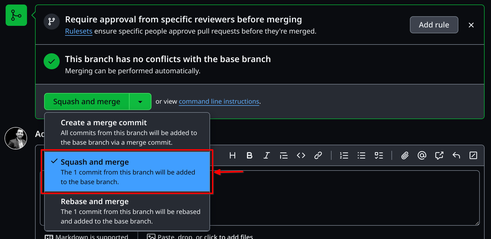
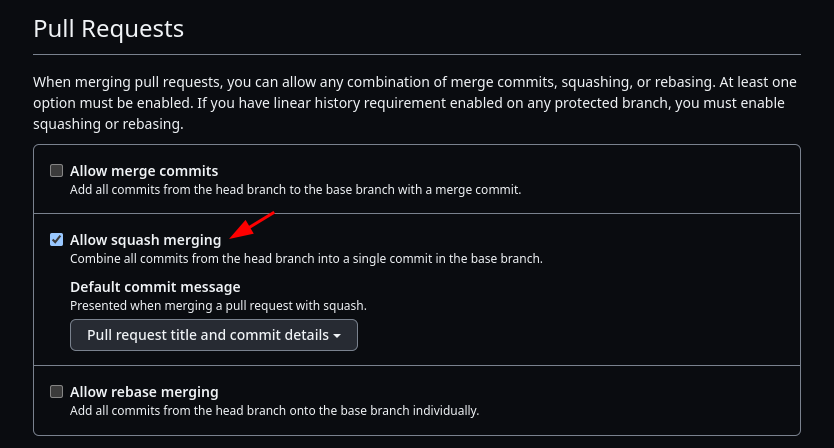
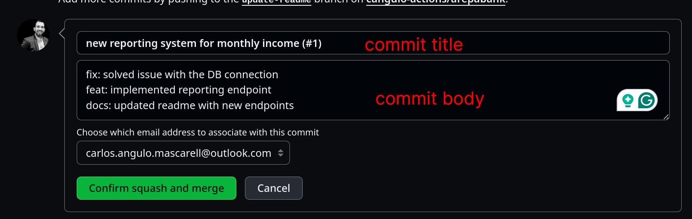

# semver <!-- omit from toc -->

This action automate any release process. You can trigger it after merging a PR and if the commits include any releasable commit it will increase the version and add the commits messages to a changelog. Check the next demo:

- [Requirements](#requirements)
  - [Repository configuration](#repository-configuration)
  - [Release details](#release-details)
- [Semantic Versioning and Conventional Commits](#semantic-versioning-and-conventional-commits)
- [Features](#features)
  - [out-of-the-box version tracking and changelog](#out-of-the-box-version-tracking-and-changelog)
  - [GH release and Job summary integration](#gh-release-and-job-summary-integration)
  - [Commit to protected branches using GH token](#commit-to-protected-branches-using-gh-token)
  - [Custom Commit Types](#custom-commit-types)
  - [Actions before committing the release](#actions-before-committing-the-release)
    - [Commands](#commands)
    - [Plugins](#plugins)

## Requirements

> [!IMPORTANT]
> - 🗜️ This GH action requires PR to be merge using **squash and merge** option.
> Please check the [Repository configuration](#repository-configuration) section  
> - 📝 All the **commits merged must follow the `<type>: <description>`**. Otherwise, the version won't increase.  
> Please check the [Conventional Commits](#semantic-versioning-and-conventional-commits) section

### Repository configuration

GH supports the next merging strategies for PRs:



This GH action needs the squash strategy, this will _squash_ all the commits in the PR into a single one pushed to the target branch. You can enforce this strategy in the repository configuration as next:



> [!TIP]
> You can configure the default commit message to `Pull request title and commit details` to facilitate the proposed release details (see next section).

### Release details

When you are about to squash your commits the GH UI shows you a panel with the next two fields:

- **Commit title**: This will be considered as the release title. If you configured the default commit message to be `Pull request title and commit details` this will be filled with the PR title.
- **Commit body**: This will include all the PR commit messages.



The release version is calculated based on the highest change type change. For the previous example, here are the changes:

```txt
fix: solved issue with the DB connection
feat: implemented reporting endpoint
docs: updated readme with new endpoints
```

The highest change here is `feat` (new feature). If the initial version is `0.0.3` the version will be increased to `0.1.0`.

> [!TIP]
> 📝 Edit the commit title in case you want to have a release title different from the PR title.  
> ✅ To ensure the PR commits follow conventional commits run the [conventional-commits-validator](https://github.com/cangulo-actions/conventional-commits-validator) GH action when a PR is open or modified.  

> [!WARNING]
> Do not modify the commit body manually in the GH UI, you risk introduce errors  

## Semantic Versioning and Conventional Commits

This GH actions aims to facilitate apps versioning following the [Semantic Versioning specification](https://semver.org). Next are the key points to consider:

- Versions follow the `x.y.z` format. Example: `2.1.2`
- Releases are divided in 3 types depending on what changes are included

| Release Type | Changes included                                 | Example                                           | Version Increase | Version            |
| ------------ | ------------------------------------------------ | ------------------------------------------------- | ---------------- | ------------------ |
| `patch`      | `bug fixes`                                      | solved error calculating prices                   | `x.y.(z+1)`      | `2.1.2` -> `2.1.3` |
| `minor`      | `new features` implemented keeping compatibility | Expose a new endpoint for reporting               | `x.(y+1).0`      | `2.1.2` -> `2.2.0` |
| `major`      | `breaking change` that make the app incompatible | Change API models renaming or deleting properties | `(x+1).0.0`      | `2.1.2` -> `3.0.0` |

- Each commit represents a change and its type must be provided in the commit message following the convention pattern:

> [!IMPORTANT]
> The pattern expected on each commit is: `<type>: <description>`

- The commit `<type>` classifies the change the commit includes. For example: `fix` means this commit includes a bug fix setting the next release to be a patch.
- The commit `<description>` explains how this commit affects the solution.
- Please note `: ` semicolon followed by one space between the type and the description.

Supported commit types by default:

 | `type`     | `release` |
 | ---------- | --------- |
 | `break`    | major     |
 | `feat`     | minor     |
 | `fix`      | patch     |
 | `refactor` | none      |
 | `chore`    | none      |
 | `test`     | none      |
 | `docs`     | none      |
 | `ci`       | none      |

- You can check the default config [in properties.commits.default at config.schema.yml](config.schema.yml)  
- Please note if more than one commit is merged. The one with the higher release type will determine the final release.  
- ⚠️ Commits merged with a different type than the previous one won't trigger a release.  
- 📑 You can customize the accepted commit types and the release linked. Please check the section [Custom Commit Types](#custom-commit-types).  
- 🔭 This GH action also supports scopes in the commit message. The pattern would be: `<type>(scope1,scope2,...,scopeN): <description>`.

<!-- Details in the [Monorepos or multilayer solutions](#monorepos-or-multilayer-solutions) section. -->

References:

- [Semantic Versioning](https://semver.org)
- [conventional commits specification](https://www.conventionalcommits.org/en/v1.0.0/#summary)

## Features

### out-of-the-box version tracking and changelog

When a PR is merged, changes will be appended to the `CHANGELOG.md` file and the version released will be updated in the `version.json` file.

### GH release and Job summary integration

GH releases integration can be enabled through the `create-gh-release` input. Same with the Job summary using the `print-summary`. Check the next example:

```yml
name: 🚀 continuous-delivery

on:
  push:
    branches:
      - main # if main is protected please provide a GH token, please check the next section

jobs:
  semver:
    name: 🚀 release new version
    runs-on: ubuntu-latest
    steps:
    - name: Checkout
      uses: actions/checkout@v4
    - name: release new version
      uses: cangulo-actions/semver@0.13.1
      id: semver
      with:
        create-gh-release: true
        print-summary: true
```

### Commit to protected branches using GH token

When you protect branches, as `main`, you can that only admins can push to it. You can create a GH bot user, [generate a token](https://docs.github.com/en/authentication/keeping-your-account-and-data-secure/managing-your-personal-access-tokens), make this GH action use that token through the `github-token` input. Commits to the protected branch after merging the PR will be done as the bot user.

You can also customize the author details through the inputs: `gh-user-name` and `gh-user-email`.

<details>

<summary>Example providing GH token</summary>

```yml
name: 🚀 continuous-delivery

on:
  push:
    branches:
      - main

jobs:
  semver:
    name: 🚀 release new version
    runs-on: ubuntu-latest
    steps:
    - name: Checkout
      uses: actions/checkout@v4
      with:
        token: ${{ secrets.CANGULO_BOT_PUSH_COMMITS }} # required for pushing to main, it is a protected branch
    - name: release new version
      uses: cangulo-actions/semver@0.13.1
      id: semver
      with:
        create-gh-release: true
        print-summary: true
```

</details>

### Custom Commit Types

You can define the commits types and its release in a yml file as next:

```yml
# .github/semver.yml
commits:
- type: break
  release: major
- type: major
  release: major
- type: feat
  release: minor
- type: fix
  release: patch
- type: refactor
  release: none
- type: chore
  release: none
- type: deploy    # useful when you trigger deployments after a PR is merged but you don't want to trigger a new release
  release: none
- type: test
  release: none
- type: docs
  release: none
- type: ci
  release: none
```

> As a proposal, name the file `.github/semver.yml` and place it in the root of your repo.

Then provide it in the `configuration` input when calling the GH action:

```yml
name: 🚀 continuous-delivery

on:
  push:
    branches:
      - main

jobs:
  semver:
    name: 🚀 release new version
    runs-on: ubuntu-latest
    steps:
    - name: Checkout
      uses: actions/checkout@v4
    - name: release new version
      uses: cangulo-actions/semver@0.13.1
      id: semver
      with:
        configuration: .github/semver.yml
        create-gh-release: true
        print-summary: true
```

### Actions before committing the release

You can execute the next actions before this GH action commit the updates to the changelog and `version.json`.

#### Commands

In order to prepare your repository for a release, you can define commands for actions as formatting files or updated docs. Next are some examples:

| Case                                        | Command                     |
| ------------------------------------------- | --------------------------- |
| format files (e.g. terraform or json files) | `terraform fmt -recursive`  |
| NPM commands                                | `npm install;npm run build` |
| Update version using grep                   | `npm install;npm run build` |
| run bash script                             | `bash ./your-script.sh`     |

Please provide them in `pre-commit.commands[]` at the configuration file:

```yml
# .github/semver.yml
pre-commit:
  commands:       # useful for npm scripts or scripts
    - npm install
    - npm run build
```

```yml
name: 🚀 continuous-delivery

on:
  push:
    branches:
      - main

jobs:
  semver:
    name: 🚀 release new version
    runs-on: ubuntu-latest
    steps:
    - name: Checkout
      uses: actions/checkout@v4
    - name: release new version
      uses: cangulo-actions/semver@0.13.1
      id: semver
      with:
        configuration: .github/semver.yml
        create-gh-release: true
        print-summary: true
```

#### Plugins

Next are the plugins you can execute:

- [update-version-readme-gh-action.js](./plugins/update-version-readme-gh-action.js): This will update any reference to your repository in a GH action format (`owner/repo@version`) in the `README.md` file. This is useful for keeping the examples updated.

Please provide them in `pre-commit.plugins[].file` at the configuration file:

```yml
# .github/semver.yml
pre-commit:
  plugins:
    - file: update-version-readme-gh-action.js
```


<!-- ### Monorepos or multilayer solutions

Let's say you have a solution with 2 layers: terraform infrastructure and source code apps in JS or C#. You can version both of them separately by defining scopes in the commits. Here are some examples:

| commit msg                                                         | change added           |
| ------------------------------------------------------------------ | ---------------------- |
| `fix(tfm): created cloudfront resources and S3 bucket`             | `*.tf` file added      |
| `break(tfm): changed API definition. reporting endpoints deleted.` | `*.tf` file modified   |
| `feat(src): Added new payments dialog to simplify`                 | `*.js,*.html` modified |
| `fix(src): fixed animation when a new user is created`             | `*.css` modified       |
 -->
