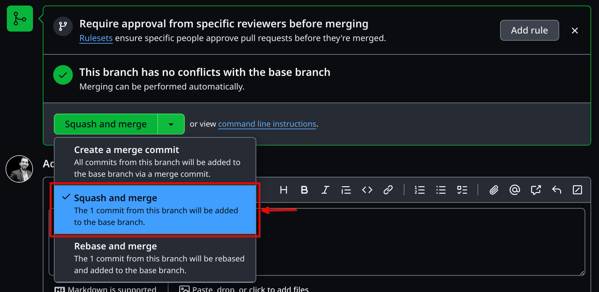
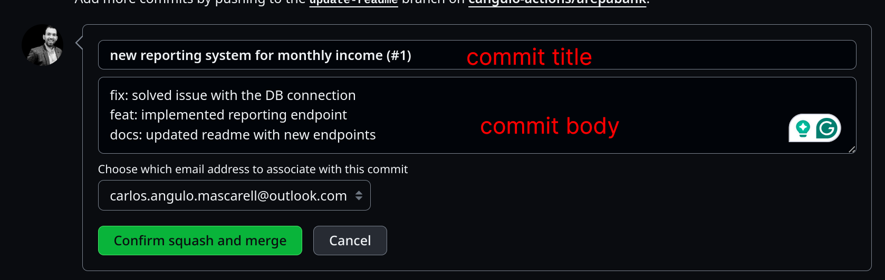
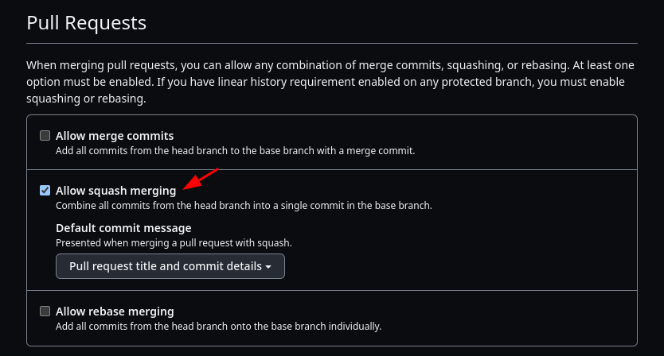

# semver <!-- omit from toc -->

- [Requirements](#requirements)
  - [Repository configuration](#repository-configuration)
  - [Release title and changes](#release-title-and-changes)
- [Conventional Commits and semver](#conventional-commits-and-semver)
- [Examples](#examples)
  - [Simplest case](#simplest-case)
  - [Custom Commit Types](#custom-commit-types)
  - [Monorepos or multilayer solutions](#monorepos-or-multilayer-solutions)

## Requirements

> * 🗜️ This GH action is designed to be executed after a PR is merged. The merging strategy required is **squash merging**, this will _squash_ all the commits into a single one pushed to your target branch. Please check the [Repository configuration](#repository-configuration) section   
> * 1️⃣ The commit merged, and all the commit messages contained, must follow conventional commits. Otherwise, the version won't increase. Please check the [Conventional Commits](#conventional-commits-and-semver) section   

### Repository configuration

Next are the different merging strategies for PRs:



This GH action needs the squash strategy which will _squash_ all the commits in the PR into a single one.



this action expects the merge commit to be a squashed one which includes all the PR commit messages in the body. You can enforce this with the next configuration in your repositories:



### Release title and changes

When you are about to squash your commits GH UI shows you a panel with the next two fields:

- **Commit title**: This will be considered as the release title.
- **Commit body**: This will include all the PR commit messages.

If both title and body are given, only the body is used to determine the next release number based on commit types like `feat` or `fix`. If only the title is provided, which is the case for PRs with a single commit, this one is used to calculate the next release number.

## Conventional Commits and semver

Semantic Version is a proposal for versioning apps based on 3 types of releases: major, minor and patch. Each one is a number integrated in the whole app version:

> `MAJOR.MINOR.PATCH`

- `MAJOR` => A major release includes changes that make the app incompatible. The first number (`MAJOR`) is increased and the previous one reset to 0.
- `MINOR` => A minor release includes new features that consumers can integrate directly or with new inputs they can provide. It increases the second number `MINOR` and reset the last one.
- `PATCH` => A patch release (or simply a patch) includes bug fixes.

This GH action aims to make the version increase depend on the commits merged. For that, commits must follow the next convention pattern:

> `<type>: <description>`

- `<type>` classifies the changes the commit includes. Each possible value is linked to a release type. For example: `fix` means this commit includes a bug fix setting the next release to be a patch. Please check the next table for the accepted types and the release linked.
- `<description>` explains how this commit affects the solution.
- Please note `: ` semicolon followed by one space between the type and the description.

| `type`     | `release` |
| ---------- | --------- |
| `break`    | major     |
| `feat`     | minor     |
| `fix`      | patch     |
| `refactor` | none      |
| `chore`    | none      |
| `test`     | none      |
| `docs`     | none      |
| `ci`       | none      |

You can check the default config [in properties.commits.default at config.schema.yml](config.schema.yml)

- Please note if more than one commit is merged. The one with the higher release type will be taken into account. Example: You merge a `fix: ...` and a `break: ...` the next version will be a major.
- ⚠️ Commits merged with a different type than the previous one won't trigger a release
- 📑 You can customize the accepted commit types and the release linked. Please check the section [Custom Commit Types](#custom-commit-types).
- 🔭 This GH action also supports scopes in the commit message. The pattern would be: `<type>(scope1,scope2,...,scopeN): <description>`. Details in the [Monorepos or multilayer solutions](#monorepos-or-multilayer-solutions) section.

References:

- [Semantic Versioning](https://semver.org)
- [conventional commits specification](https://www.conventionalcommits.org/en/v1.0.0/#summary)

## Examples

### Simplest case

Here is an example that will tag and create GH releases when a PR is merged

```yml
name: 🚀 continuous-delivery

on:
  push:
    branches:
      - main

jobs:
  semver:
    name: 🚀 release new version
    runs-on: ubuntu-latest
    steps:
    - name: Checkout
      uses: actions/checkout@v4.1.1
    - name: release new version
      uses: cangulo-actions/semver@main
      id: semver
      with:
        create-gh-release: true
        print-summary: true
    - name: print semver output
      if: ${{ steps.semver.outputs.new-version-released }}
      env:
        CHANGES: ${{ steps.semver.outputs.changes }}
        CHANGELOG_RECORD: ${{ steps.semver.outputs.changelog-record }}
      run: |
        echo "version:        ${{ steps.semver.outputs.version }}"
        echo "release-title:  ${{ steps.semver.outputs.release-title }}"
        echo "release-type:   ${{ steps.semver.outputs.release-type }}"
        echo "release-url:    ${{ steps.semver.outputs.release-url }}"
        echo "commit-id:      ${{ steps.semver.outputs.commit-id }}"

        echo "changes:"
        echo "$CHANGES" | jq .

        echo "changes-log:"
        echo "$CHANGELOG_RECORD"
```

You can copy it from the [cd.yml](.github/workflows/cd.yml)

### Custom Commit Types

You can define the commits types and its release in a yml file as next:

```yml
commits:
- type: break
  release: major
- type: major
  release: major
- type: feat
  release: minor
- type: fix
  release: patch
- type: refactor
  release: none
- type: chore
  release: none
- type: test
  release: none
- type: docs
  release: none
- type: ci
  release: none
```

> Please note the `changeTypes` at the root level.
> As a proposal, name the file `semver.yml` and place it in the root of your repo.

Then provide it in the `configuration` input when calling the GH action:

```yml
name: 🚀 continuous-delivery

on:
  push:
    branches:
      - main

jobs:
  semver:
    name: 🚀 release new version
    runs-on: ubuntu-latest
    steps:
    - name: Checkout
      uses: actions/checkout@v4.1.1
    - name: release new version
      uses: cangulo-actions/semver@main
      id: semver
      with:
        configuration: semver.yml
        create-gh-release: true
        print-summary: true
```

### Monorepos or multilayer solutions

Let's say you have a solution with 2 layers: terraform infrastructure and source code apps in JS or C#. You can version both of them separately by defining scopes in the commits. Here are some examples:

| commit msg                                                         | change added           |
| ------------------------------------------------------------------ | ---------------------- |
| `fix(tfm): created cloudfront resources and S3 bucket`             | `*.tf` file added      |
| `break(tfm): changed API definition. reporting endpoints deleted.` | `*.tf` file modified   |
| `feat(src): Added new payments dialog to simplify`                 | `*.js,*.html` modified |
| `fix(src): fixed animation when a new user is created`             | `*.css` modified       |

For doing so, you have to provide the con
