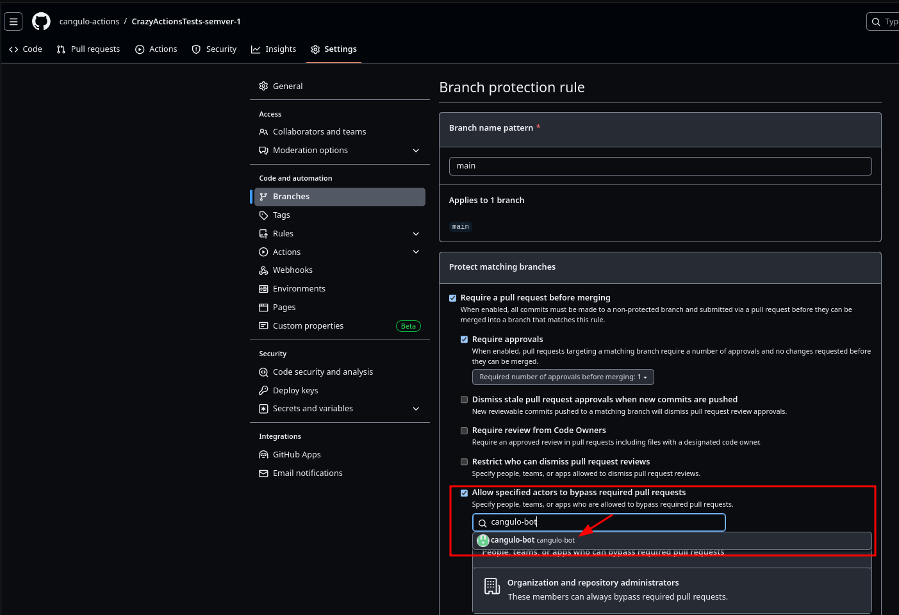
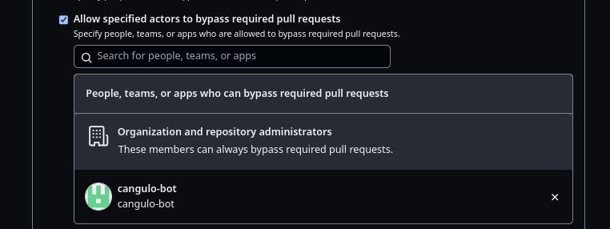
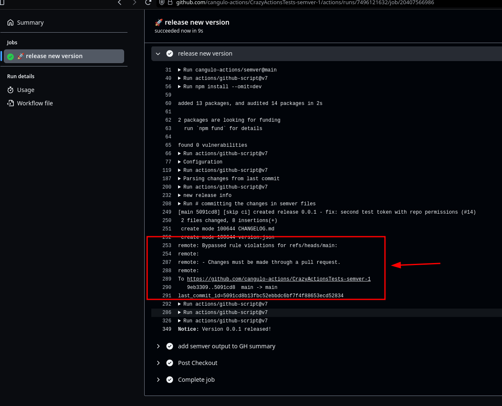

# Test 3

## conditions

* `main` has branch protection enabled
* `token` has repo permissions
* `user` added as writer to the repo


* `main` branch protection can be bypass by cangulo-bot



Once configuration is saved:



## workflow

```yml
name: 🚀 continuous-delivery

on:
  push:
    branches:
      - main

jobs:
  semver:
    name: 🚀 release new version
    runs-on: ubuntu-latest
    steps:
    - name: Checkout
      uses: actions/checkout@v4.1.1
      with:
        token: ${{ secrets.TOKEN_FOR_PUSH_TO_PROTECTED_BRANCH }}
      

    - name: release new version
      uses: cangulo-actions/semver@main
      id: semver
      with:
        create-gh-release: true
        print-summary: true
        print-annotations: true

# refresh-20240112
```

## It works

No error 🥳



## Links

[workflow executed link](https://github.com/cangulo-actions/CrazyActionsTests-semver-1/actions/runs/7496121632/job/20407566986)